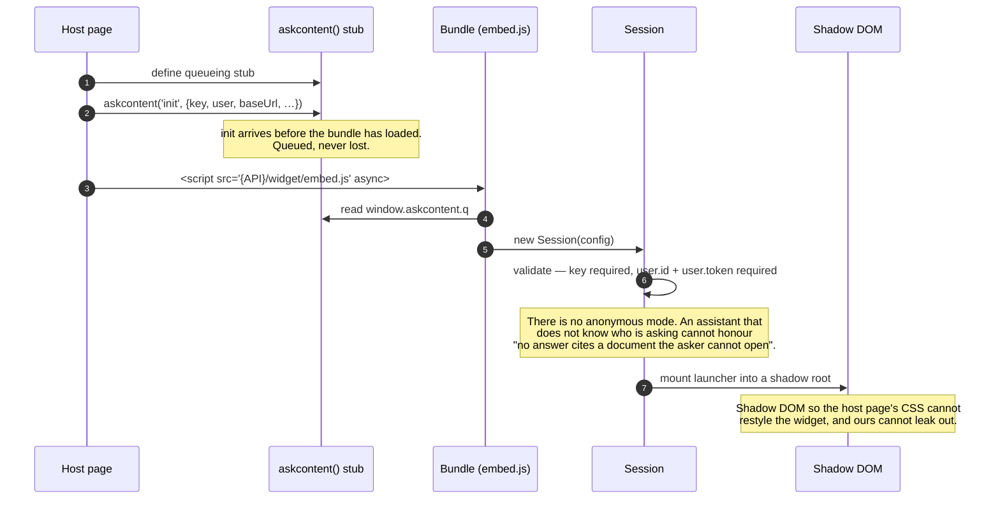
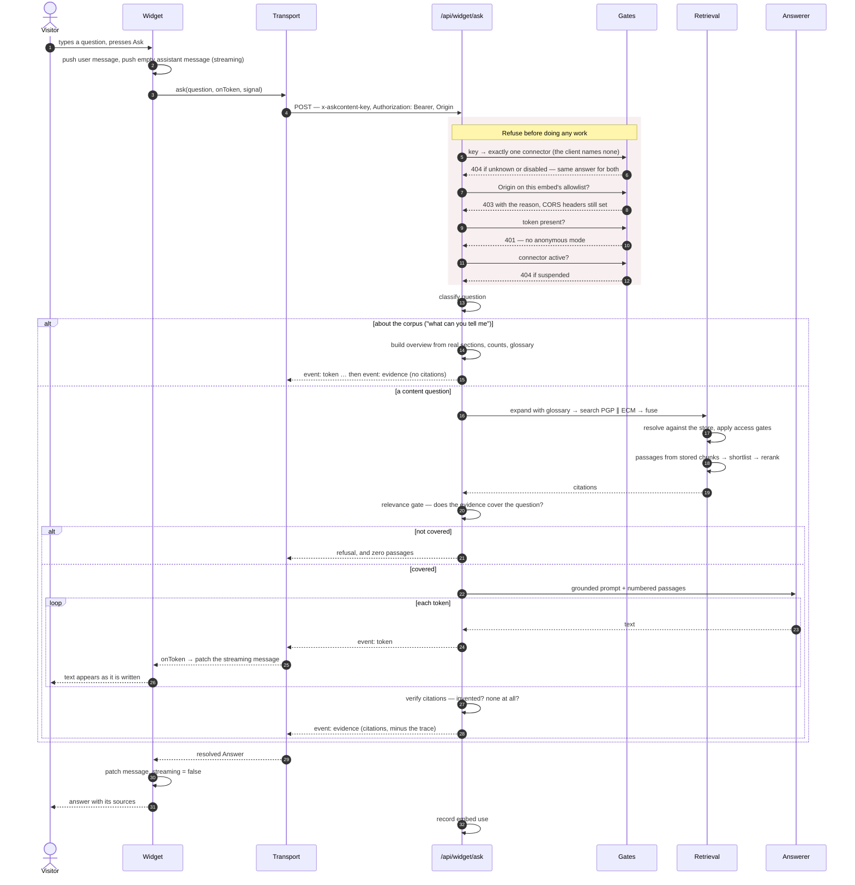

# 01 · What happens when somebody uses the widget

`WGT-SEQ-*`

Two diagrams. The first is installation and boot, which happens once per page
load. The second is one question, which is the interesting one.

---

## 1. Boot

The script tag is pasted by somebody who does not work on this product, into a
page nobody on this team can edit. Everything about the boot sequence follows
from that.



**Why the stub matters.** `init` runs before the bundle finishes downloading —
that is the normal case on a real page, not an edge case. A call that arrives
early must be queued rather than lost.

---

## 2. One question



---

## 3. The decisions inside that diagram

**The client names no connector.** It presents a publishable key, and the key
resolves to exactly one connector server-side. There is no field in which to
put a connector, so a client cannot widen its own reach — the closed-grammar
argument applied to the client.

**The client names no role.** The principal comes from the visitor's token. A
widget that could choose who it was asking as would make every access rule
advisory.

**An unknown key and a disabled embed return the same 404.** Distinguishing
them turns the endpoint into an oracle for which keys exist.

**An empty origin allowlist permits nothing.** That is the safe reading of "no
rules yet", and the opposite of the usual one — which is why it is stated
rather than left to a falsy check.

**The origin is reflected in CORS even when refused.** CORS is not the security
boundary here; the allowlist check is, and it runs on every request. Blocking
at the CORS layer instead would replace an explanatory 403 with the browser's
"Failed to fetch", which is the error somebody spends an afternoon on.

**The trace is stripped.** It names documents a visitor was refused, which is a
question about somebody else's access.

**Prose and evidence are separate events.** `token` frames stream; one
`evidence` frame carries the citations. The prose may vary between runs, the
citations must not, and merging them would make the varying half look as
authoritative as the stable one. The widget **refuses to render prose that
arrived without its evidence frame** — an answer with no evidence is ungrounded
text, which is the one thing this product must never present.

---

## 4. Failure paths

| What happens | What the visitor sees |
|---|---|
| 401 / 403 | "This assistant could not verify who you are. Reload the page and sign in again." |
| 404 | "This assistant is not configured on this page." |
| 429 | "Too many questions at once. Try again in a moment." |
| 5xx | "The assistant is unavailable. Nothing you did caused this." |
| Stream dies mid-answer | The partial answer is discarded — no evidence frame, no render |
| Buffering proxy kills SSE | Falls back to a single JSON response; the answer still arrives |
| Corpus does not cover it | A refusal, and **no** passages |

---

## 5. Installing it

```html
<script>
  (function (w, d) {
    w.askcontent = w.askcontent || function () {
      (w.askcontent.q = w.askcontent.q || []).push(arguments)
    };
    var s = d.createElement('script');
    s.src = 'https://api.example.com/widget/embed.js'; s.async = true;
    d.head.appendChild(s);
  })(window, document);

  askcontent('init', {
    key: 'pk_…',                    // public by construction; authorises nothing
    baseUrl: 'https://api.example.com',
    title: 'Ask the help centre',
    user: { id: CURRENT_USER_ID, token: CURRENT_USER_TOKEN },
  });
</script>
```

React, for applications with their own routing and state:

```jsx
import { AskContent } from '@askcontent/widget/react'

<AskContent publicKey="pk_…" baseUrl="…" user={{ id, token }} />
```

The prop is `publicKey`, not `key` — React reserves `key` and strips it before
a component sees it.

**The token is minted by your server, per visitor, short-lived.** The widget
never sees a credential it could reuse, and the platform never trusts an
identity the page asserted about itself.

> **Not production ready.** The token is currently *not verified* server-side.
> See [production readiness §2.2](../../askcontent-backend/docs/engineering/01-production-readiness.md).
